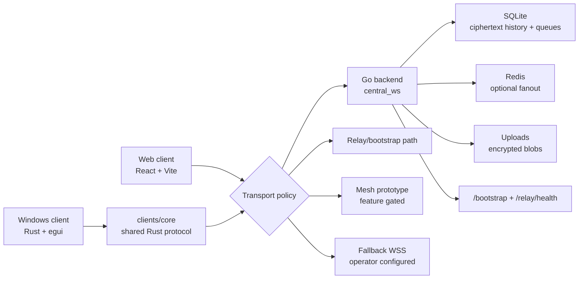

# Messk

[](https://github.com/kristexIO/messk/actions/workflows/ci.yml)


Messk is a full-stack end-to-end encrypted messenger built around a simple
principle: the server routes ciphertext, while clients own identity, message
plaintext, device state, and local recovery.

The platform includes a production Go backend, a React/Vite web client, a
shared Rust protocol core, and a native Rust/egui Windows client. The Windows
app is intentionally native: no Electron, no Tauri, no embedded WebView.

## Why Messk

Most messenger prototypes stop at "messages over a socket." Messk is being
built as a product-grade system with the parts that make encrypted messaging
survive real usage:

- ciphertext-only routing and storage on the backend;
- retry-safe direct messages with stable `msg_id` dedupe;
- offline delivery, acknowledgement, and encrypted history recovery;
- encrypted attachment upload/download with access control;
- profile, directory, group, channel, invite, moderation, and admin foundations;
- cross-client protocol mirrors for Go, TypeScript, and Rust;
- native Windows identity storage protected by DPAPI;
- repeatable release scripts, health checks, backups, and VPS hardening.
- relay/bootstrap discovery with signed relay capabilities;
- feature-gated libp2p mesh prototype for staged resilience experiments;
- metadata-resistance foundations: padding, batch windows, and dummy envelopes.

## Product Surface

| Area | Status |
| --- | --- |
| Direct E2EE chat | Online/offline delivery, retries, receipts, edit/delete, reactions, replies, pins, search. |
| Web client | Production reference UX for auth, chat, files, calls signaling UI, groups/channels foundations. |
| Windows client | Native Rust/egui shell with local SQLite, DPAPI vaulting, message state, media foundations, notifications, playback modules. |
| Shared Rust core | Protocol constants, payload parsing, history cursors, retry rules, and storage contract tests. |
| Backend | HTTP/WebSocket router, SQLite persistence, Redis fanout option, uploads, health/version/admin endpoints. |
| Relay/bootstrap | Signed relay announcements, peer registry, relay health, bootstrap discovery. |
| Mesh prototype | Feature-gated libp2p builders and simulator for Gossipsub, Kademlia, AutoNAT, DCUtR, Relay v2. |
| Operations | PowerShell release gates, smoke checks, backups, key-based VPS deploy, nginx/ufw/fail2ban/sysctl hardening. |

## Main Branch Release State

| Gate | Status |
| --- | --- |
| GitHub Actions on `main` | Green after the mesh/relay merge. |
| Frontend dependency audit | `npm audit` reports 0 vulnerabilities. |
| Backend tests | `go test ./...` passes. |
| Shared Rust core | Default and `mesh-prototype` tests pass. |
| Native Windows client | Tests, clippy, and build pass. |
| VPS deploy | Ready for key-based staging deploy after operator SSH key setup. |

## Architecture



The backend is the protocol source of truth. Client-facing contract changes must
be mirrored in:

- `mess/` for Go validation and routing;
- `messk/src/lib/protocolContract.ts` for the web client;
- `clients/core/` for native and future mobile clients.

## Repository Layout

| Path | Purpose |
| --- | --- |
| `mess/` | Go backend and server-side protocol enforcement. |
| `messk/` | React/Vite web client and reference user experience. |
| `clients/core/` | Shared Rust protocol/core crate for native clients. |
| `clients/windows/` | Native Windows client, no WebView/Tauri/Electron. |
| `scripts/` | Repeatable checks, builds, release, smoke, and VPS deploy helpers. |
| `docs/` | Protocol contract, project structure, Windows direction, shared-core notes, roadmap. |

## Quick Start

Run the full local gate from the repository root:

```powershell
powershell -ExecutionPolicy Bypass -File scripts\check-all.ps1
```

Run the web client:

```powershell
cd messk
npm ci
npm run dev
```

Run the backend:

```powershell
cd mess
go test ./...
go run .
```

Run the native Windows client:

```powershell
cd clients\windows
cargo run
```

Build the Windows executable from the repository root:

```powershell
powershell -ExecutionPolicy Bypass -File scripts\build-windows-client.ps1 -Configuration debug
```

## Release And Deploy

Create release artifacts:

```powershell
powershell -ExecutionPolicy Bypass -File scripts\release-build.ps1 -BackendOrigin https://messk.online
```

Deploy to a VPS:

```powershell
powershell -ExecutionPolicy Bypass -File scripts\deploy-vps.ps1 `
  -ServerHost <server-host> `
  -User root `
  -KeyFile $env:USERPROFILE\.ssh\messk_prod_ed25519 `
  -Domain <domain>
```

The deploy script builds the backend and web client on the server, creates a new
release directory, switches `/opt/messan/current`, restarts services, verifies
`/health` and `/version`, and keeps rollback releases. It also applies production
hardening for nginx, UFW, fail2ban, sysctl, swap, service limits, and systemd
sandboxing.

Password-based SSH is only acceptable for a one-time bootstrap before key
rotation. Production deploys should use `-KeyFile`, with private keys, tokens,
and `.env` files kept outside the repository.

## Security Model

- Message text and decrypted files must never be stored on the server.
- Uploads are encrypted locally before leaving the client.
- Direct controls such as edit, delete, reaction, reply, pin, and unpin are
  represented as encrypted envelopes.
- The server overwrites authenticated sender identity and rejects malformed
  control events before routing.
- Windows identity/session secrets are protected with DPAPI before local SQLite
  persistence.
- Metadata proxying is disabled by default and should stay disabled unless a
  production use case is reviewed.
- Mesh prototype code is disabled by default and only compiles with the
  explicit `mesh-prototype` Rust feature.
- Production deploys must pass the release checklist, health smoke, backup, and
  rollback steps before promotion.

Messk has not been independently audited. Treat it as a serious engineering
project, not as audited cryptographic infrastructure.

See [docs/PROTOCOL_CONTRACT.md](docs/PROTOCOL_CONTRACT.md),
[RELEASE_CHECKLIST.md](RELEASE_CHECKLIST.md), and [SECURITY.md](SECURITY.md) for
the operational contract.

## Documentation

- [Protocol contract](docs/PROTOCOL_CONTRACT.md)
- [Project structure](docs/PROJECT_STRUCTURE.md)
- [Windows client](docs/WINDOWS_CLIENT.md)
- [Shared Rust core](docs/SHARED_RUST_CORE.md)
- [Roadmap](docs/ROADMAP.md)
- [Main release report](docs/MAIN_RELEASE_REPORT.md)
- [Mesh/libp2p release report](docs/MESH_LIBP2P_RELEASE_REPORT.md)
- [Operator tutorial RU](docs/OPERATOR_TUTORIAL_RU.md)
- [Release checklist](RELEASE_CHECKLIST.md)

## Roadmap

Short term:

- finish native media UX: previews, voice playback, attachment gallery, and
  encrypted upload/download polish;
- add native call signaling UI and then audio-only calls;
- bring groups/channels parity from web to Windows;
- continue extracting protocol/session behavior into `clients/core`.

Long term:

- mobile clients through the shared Rust core;
- signed Windows installer, tray mode, notifications, and auto-start;
- staging-to-production release flow with monitoring, rollback, and alerts.

## Contributing

Before opening a PR, run:

```powershell
powershell -ExecutionPolicy Bypass -File scripts\check-all.ps1
```

Keep protocol changes synchronized across backend tests, web contract tests, and
Rust core tests. Security and reliability win over UI speed when tradeoffs
conflict.
