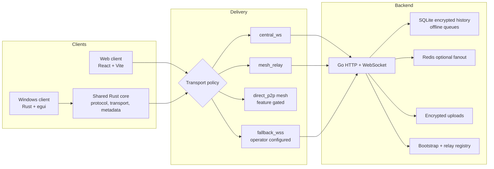
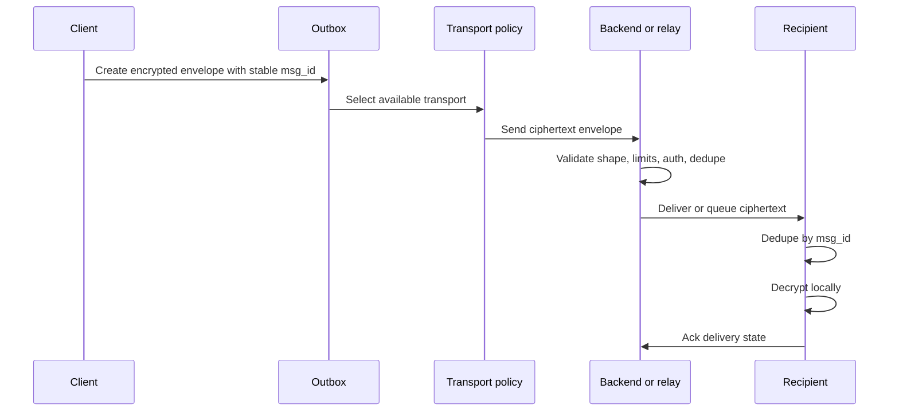
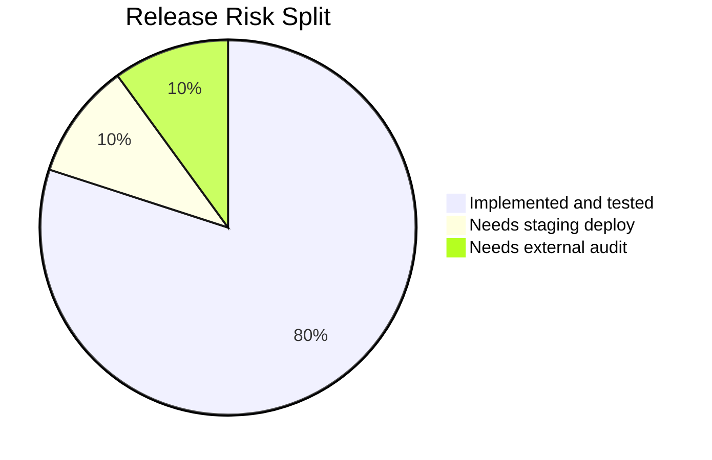

# Messk Main Release Report

## Summary

This document describes the consolidated `main` branch state after the
resilient delivery, relay, metadata, mesh prototype, dependency refresh, and
VPS hardening work was merged.

The project is now shaped as a resilient E2EE messenger platform:

- Go backend routes ciphertext and stores encrypted queues/history.
- React/Vite web client remains the reference product UX.
- Rust shared core owns protocol contracts that native clients can reuse.
- Native Windows client is a real Rust/egui app with SQLite and DPAPI storage.
- Relay/bootstrap and mesh prototype work is feature-gated and staged.
- VPS deployment is key-based by default and keeps secrets outside the repo.

## Release Dashboard

| Area | State | Evidence |
| --- | --- | --- |
| Direct E2EE messaging | Ready for staging | Offline delivery, retries, encrypted history, dedupe, attachments. |
| Relay/bootstrap backend | Ready for staging | `/relay/health`, `/relay/peers`, `/relay/announce`, `/bootstrap`. |
| Metadata resistance | Ready for staging | Padding buckets, batch windows, dummy envelope policy in shared core. |
| Mesh prototype | R&D gated | Requires Rust feature `mesh-prototype`; not enabled in normal builds. |
| Web client | Green | Lint, tests, production build. |
| Windows client | Green | Tests, clippy, debug build. |
| CI | Green | GitHub Actions success on merged branch. |
| VPS deployment | Needs operator key and staging access | Host-key pinning, staging evidence gate, verified backup and rollback scripts are implemented. |

## System Architecture

## Security Boundary

| Data | Server or relay can see | Client-only |
| --- | --- | --- |
| Message text | No | Yes |
| Attachment plaintext | No | Yes |
| File keys | No | Yes |
| Identity seed | No | Yes |
| Ratchet/session secrets | No | Yes |
| Routed message body | Ciphertext only | Plaintext before encryption and after decrypt |
| Mesh envelope | Topic, `msg_id`, TTL, hop limit, ciphertext | Sender/recipient meaning and decrypted payload |

Forbidden in backend, relay, logs, and repository:

- production passwords;
- private SSH keys;
- admin tokens;
- relay signing keys;
- ratchet state;
- file encryption keys;
- decrypted messages;
- session tokens.

## Delivery Flow

## Roadmap Progress

| Phase | Goal | Main branch state |
| --- | --- | --- |
| Phase 0 | Security cleanup | Key-based deploy path, secret-free docs, release gates. |
| Phase 1 | Core hardening | Direct chat, offline queues, encrypted history, file encryption foundations. |
| Phase 2 | Shared native core | Protocol, payload, metadata, transport contracts in `clients/core`. |
| Phase 3 | Relay-ready backend | Relay health, peers, announce, bootstrap, capability validation. |
| Phase 4 | Mesh prototype | libp2p builders and simulator behind `mesh-prototype`. |
| Phase 5 | Metadata resistance | Padding, batching, dummy envelope policies. |
| Phase 6 | Fallback transports | Priority-based transport policy and configured fallback origins. |
| Phase 7 | Groups, channels, calls parity | Foundations exist; Windows parity still needs product polish. |
| Phase 8 | Audit and release | Release manifests, staged promotion gates and protected process counters are implemented; external audit and signed installer remain future work. |

## Verification Matrix

| Command | Purpose | Expected result |
| --- | --- | --- |
| `powershell -ExecutionPolicy Bypass -File scripts\check-all.ps1` | Full local gate | All checks passed. |
| `go test ./...` in `mess` | Backend tests | Pass. |
| `npm run lint` in `messk` | Frontend static checks | Pass. |
| `npm test` in `messk` | Frontend unit/contract tests | Pass. |
| `npm run build` in `messk` | Production web build | Pass. |
| `cargo test --manifest-path clients/core/Cargo.toml` | Shared core tests | Pass. |
| `cargo test --manifest-path clients/core/Cargo.toml --features mesh-prototype` | Mesh prototype tests | Pass. |
| `cargo test --manifest-path clients/windows/Cargo.toml` | Native client tests | Pass. |
| `cargo clippy --manifest-path clients/windows/Cargo.toml -- -D warnings` | Native client lint gate | Pass. |

## Dependency State

| Stack | Current posture |
| --- | --- |
| Node/npm | Frontend dependencies refreshed; `npm audit` is clean. |
| Go | Direct backend dependencies and security-sensitive `golang.org/x/*` modules refreshed. |
| Rust core | `libp2p` remains on latest available `0.56.0`; mesh code stays optional. |
| Windows Rust | Tokio, Reqwest, Rusqlite, RFD, and lockfile refreshed to compatible versions. |
| GitHub Actions | Official checkout/setup actions moved to current v6 tags. |

Some prerelease crypto crates remain pinned by upstream compatibility. Moving
them should be treated as a separate protocol migration, not a general
dependency refresh.

## Operational Risk Chart

## Risk Register

| Risk | Impact | Mitigation |
| --- | --- | --- |
| Production secrets enter git | Critical | Use env files, VPS secrets, systemd environment, and secret scans before commits. |
| Password-based VPS access remains enabled | High | Add SSH key, deploy with `-KeyFile`, then disable password login. |
| Mesh prototype enabled too early | High | Keep `mesh-prototype` disabled in production until staged abuse controls pass. |
| Relay abuse or Sybil pressure | High | Signed capabilities, invite/token issuance, revocation epochs, rate limits. |
| Queue growth or operational failures under outage | Medium | Monitor protected `/admin/health` queue and event counters, Redis degraded mode, and backups. |
| Windows parity gaps | Medium | Keep moving shared behavior into `clients/core`; Windows remains a shell over core. |

## Production Readiness Gates

Before a production release is marked ready:

1. GitHub Actions must be green on `main`.
2. `scripts/check-all.ps1` must pass locally on the release machine.
3. VPS access must be SSH-key based.
4. DNS must point to the VPS and HTTPS must be configured.
5. `/health`, `/version`, `/protocol`, `/relay/health`, and `/bootstrap` must pass after deploy.
6. The exact commit must have a recent staging smoke report; backup and rollback must be tested once on staging.
7. No production secrets may appear in git, logs, screenshots, reports, or PR text.
8. Mesh prototype must remain disabled unless the release is explicitly a staging mesh test.
