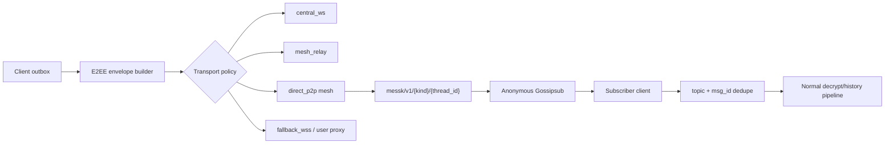
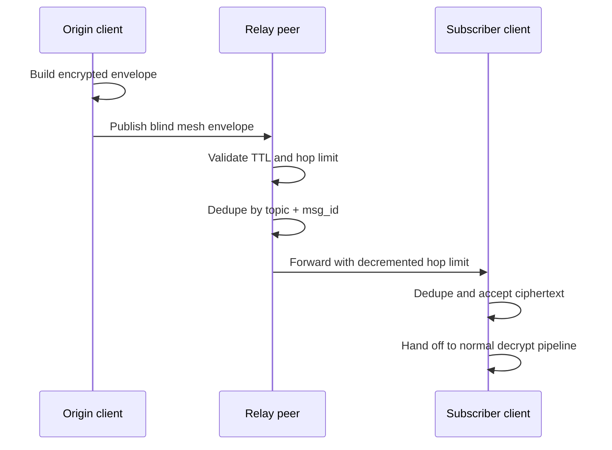
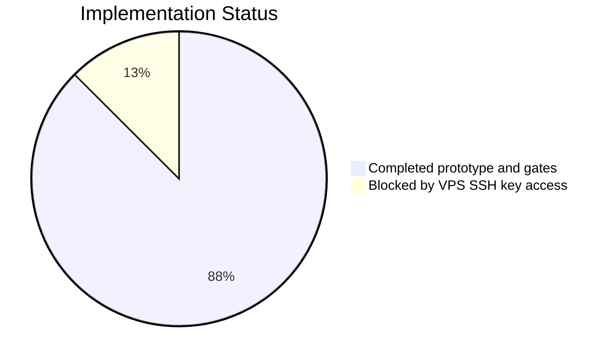

# Messk Mesh Prototype Release Report

## Executive Summary

This release adds the first production-gated mesh transport prototype for
Messk. The default product remains the existing encrypted client-server
messenger; the new mesh work is available only through the explicit
`mesh-prototype` Rust feature.

## Delivery Map

| Area | Status | Notes |
| --- | --- | --- |
| Blind mesh envelope contract | Done | Stable topic, `msg_id`, TTL, hop limit, dedupe key. |
| Rust local mesh simulator | Done | Covers 3-9 nodes, duplicate paths, expiry, hop exhaustion, relay loss. |
| Web protocol fixtures | Done | Mirrors topic/envelope validation and invalid-payload rejection. |
| libp2p adapter layer | Done | Builds anonymous Gossipsub, Kademlia, Identify, AutoNAT, DCUtR, Relay v2. |
| Composable swarm parts | Done | Uses optional `Toggle` behaviours for staged swarm experiments. |
| Production gating | Done | `libp2p` is optional and excluded unless `--features mesh-prototype` is used. |
| VPS deploy hardening | Done | Adds SSH key deploy path and password-only bootstrap warning. |
| Live VPS deploy | Blocked | Current workstation has no accepted public-key SSH access to the VPS. |

## Architecture

## Blind Envelope Rules

| Field | Purpose | Validation |
| --- | --- | --- |
| `v` | Mesh contract version | Must equal `1`. |
| `topic` | Non-identifying route topic | Must match `messk/v1/<direct|group|channel>/<thread_id>`. |
| `msgId` | Idempotency key | Required, ASCII-safe, stable across retries. |
| `ciphertext` | Opaque encrypted payload | Required, non-empty, bounded size. |
| `hopLimit` | Forwarding limit | Must not exceed `8`; decremented per hop. |
| `expiresAtMs` | TTL cutoff | Expired envelopes are dropped. |

Forbidden at the mesh boundary: sender identity, recipient identity, plaintext,
file keys, ratchet secrets, session secrets, and session tokens.

## Mesh Delivery Flow

## Test Coverage

| Check | Result |
| --- | --- |
| Backend Go tests | Passed |
| Frontend lint | Passed |
| Frontend tests | 44 passed |
| Frontend production build | Passed |
| `clients/core` tests | 33 passed |
| `clients/core --features mesh-prototype` tests | 48 passed |
| `clients/windows` tests | 27 passed |
| Core clippy with `-D warnings` | Passed |
| Windows clippy with `-D warnings` | Passed |
| Full `scripts/check-all.ps1` | Passed |

## Dependency Refresh

| Stack | Refresh | Verification |
| --- | --- | --- |
| Frontend | React 19.2, Vite 8, ESLint 10, Vitest 4, Tailwind 4, latest npm tree | `npm outdated` clean, `npm audit` 0 vulnerabilities. |
| Backend | Go 1.26.2 module target, Redis 9.19, `x/crypto` 0.51, SQLite 1.50 | `go test ./...` passed. |
| Rust core | `serde_json` 1.0.149, libp2p remains latest 0.56.0 | Default and `mesh-prototype` tests passed. |
| Windows native | Tokio 1.52, Reqwest 0.13, Rusqlite 0.39, RFD 0.17 | Tests and clippy passed. |
| CI | Official checkout/setup actions moved to v6 | Full local preflight passed before push. |

Some crypto-adjacent prerelease crates remain pinned by their upstream
compatibility graph. They should move only with a focused protocol migration,
not as a drive-by dependency bump.

## Risk Matrix

| Risk | Mitigation |
| --- | --- |
| Mesh code accidentally ships in normal builds | Optional dependency gated behind `mesh-prototype`. |
| Relay learns plaintext or session material | Blind envelope validation rejects identity/plaintext/secret fields. |
| Duplicate gossip causes replay-like behavior | Dedupe cache uses `topic + msg_id` until envelope expiry. |
| Infinite forwarding loops | Hop limit is validated and decremented per hop. |
| Password-based VPS operations remain default | Deploy script now supports `-KeyFile` and warns on password bootstrap. |

## Release State

## Operator Checklist

1. Merge the feature branch after CI is green.
2. Add an SSH public key to the VPS root account or create a non-root deploy user.
3. Run the deploy script with `-KeyFile`, not password arguments.
4. Verify `/health`, `/relay/health`, `/bootstrap`, and web login after deploy.
5. Keep `mesh-prototype` disabled in production until swarm runner and abuse
   controls pass staging tests.
