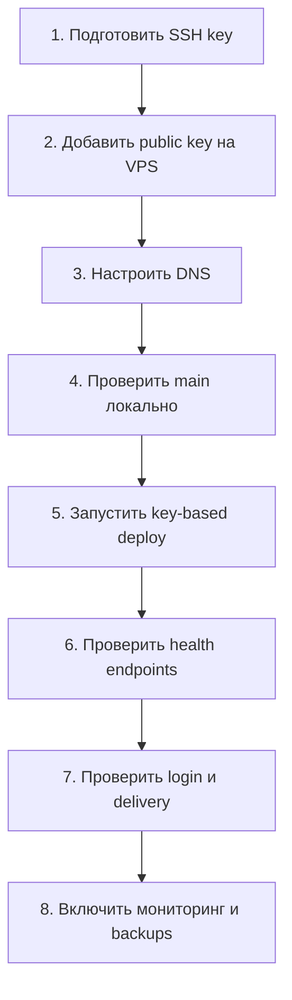
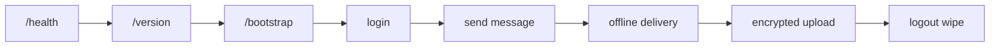

# Messk: тутор для оператора

Этот документ описывает, что требуется от владельца проекта, чтобы безопасно
довести `main` до staging или production deploy.

## Что уже готово

| Блок | Статус | Что это значит |
| --- | --- | --- |
| Backend | Готов к staging | Go сервер, WebSocket, очереди, encrypted uploads, relay/bootstrap endpoints. |
| Web | Готов к staging | React/Vite клиент собирается production build. |
| Windows | Готов к staging | Native Rust клиент проходит tests/clippy/build. |
| Shared core | Готов к расширению | Rust crate держит protocol, metadata, transport и mesh contracts. |
| Mesh prototype | Только R&D | Включается только через `--features mesh-prototype`. |
| VPS deploy | Ждет ключ | Скрипт готов, но безопасный deploy требует SSH key. |

## Что требуется от тебя

| Нужно | Где взять | Почему важно |
| --- | --- | --- |
| Доступ к панели VPS | Личный кабинет провайдера | Чтобы добавить SSH public key без передачи пароля. |
| SSH public key | Генерируется локально | Без него нельзя безопасно деплоить. |
| SSH host public key сервера | Панель VPS или проверенный out-of-band источник | Чтобы deploy отклонял подмененный SSH-сервер. |
| Домен | DNS-панель домена | Нужен нормальный HTTPS origin для web/backend. |
| A-record домена | DNS-панель | Должен указывать на VPS. |
| Admin token | Генерируется локально | Для `/admin/health` и операционных проверок. |
| Relay announce token | Генерируется локально | Для публикации relay capability. |
| Решение по TURN | Отдельный TURN или пока без него | Нужно для стабильных звонков за NAT. |
| Окно деплоя | Согласованное время | Чтобы спокойно проверить health, login, messages, rollback. |

Нельзя присылать в чат и нельзя коммитить:

- root password;
- private SSH key;
- admin token;
- relay signing key;
- production `.env`;
- database backup with live user data;
- screenshots with tokens or server secrets.

## Общая схема запуска



## Шаг 1. Сгенерировать SSH key

На Windows PowerShell:

```powershell
ssh-keygen -t ed25519 -a 64 -f $env:USERPROFILE\.ssh\messk_prod_ed25519 -C "messk-prod"
```

Файлы:

| Файл | Что это | Можно передавать |
| --- | --- | --- |
| `messk_prod_ed25519` | Private key | Нет |
| `messk_prod_ed25519.pub` | Public key | Да, его добавляют на VPS |

Показать public key:

```powershell
Get-Content $env:USERPROFILE\.ssh\messk_prod_ed25519.pub
```

## Шаг 2. Добавить public key на VPS

Лучший вариант: через панель провайдера VPS добавить public key в root account
или создать отдельного deploy-user с sudo.

После добавления проверить вход:

```powershell
ssh -i $env:USERPROFILE\.ssh\messk_prod_ed25519 root@<server-host>
```

Если вход по ключу работает, пароль больше не нужен для deploy.

## Шаг 3. Настроить DNS

В DNS-панели домена добавить:

| Type | Name | Value |
| --- | --- | --- |
| A | `@` | `<server-ip>` |
| A | `www` | `<server-ip>` |

Проверить:

```powershell
nslookup your-domain.example
```

## Шаг 4. Локальная проверка main

Из корня репозитория:

```powershell
git checkout main
git pull --ff-only origin main
powershell -ExecutionPolicy Bypass -File scripts\check-all.ps1
```

Дополнительная mesh-проверка:

```powershell
cargo test --manifest-path clients/core/Cargo.toml --features mesh-prototype
```

## Шаг 5. Production config

Перед сборкой указать backend origin:

```powershell
powershell -ExecutionPolicy Bypass -File scripts\configure-release.ps1 -BackendOrigin https://your-domain.example
```

Собрать release artifacts:

```powershell
powershell -ExecutionPolicy Bypass -File scripts\release-build.ps1 -BackendOrigin https://your-domain.example
```

## Шаг 6. Deploy на VPS

Только key-based:

```powershell
powershell -ExecutionPolicy Bypass -File scripts\deploy-vps.ps1 `
  -ServerHost <server-host> `
  -User root `
  -KeyFile $env:USERPROFILE\.ssh\messk_prod_ed25519 `
  -HostPublicKey 'ssh-ed25519 <server-host-public-key>' `
  -Domain your-domain.example
```

Если нужен TURN для звонков:

```powershell
powershell -ExecutionPolicy Bypass -File scripts\deploy-vps.ps1 `
  -ServerHost <server-host> `
  -User root `
  -KeyFile $env:USERPROFILE\.ssh\messk_prod_ed25519 `
  -HostPublicKey 'ssh-ed25519 <server-host-public-key>' `
  -Domain your-domain.example `
  -TurnHost turn.your-domain.example `
  -TurnUsername <turn-user> `
  -TurnPassword <turn-password>
```

`TurnPassword` не коммитить и не вставлять в документы.

## Шаг 7. Проверка после deploy

| Проверка | Команда или URL | Ожидание |
| --- | --- | --- |
| Backend health | `https://your-domain.example/health` | `ok` или ожидаемый `degraded`. |
| Version | `https://your-domain.example/version` | Нужный commit/build time. |
| Relay health | `https://your-domain.example/relay/health` | Relay mode отвечает. |
| Bootstrap | `https://your-domain.example/bootstrap` | Клиент получает origins/capabilities. |
| Web login | Открыть домен в браузере | Логин/регистрация работают. |
| Direct delivery | Два клиента | Online/offline сообщения доставляются. |
| Uploads | Файл в чат | Файл хранится зашифрованным. |
| Logout wipe | Logout в клиенте | Локальное состояние очищается. |

Публичный `/health` показывает только статус сервиса. Операционные счетчики
очередей и сокетов доступны через `/admin/health` на loopback VPS. Для проверки
с рабочей машины откройте туннель и выполните threshold-check:

```powershell
ssh -L 18080:127.0.0.1:8080 -i $env:USERPROFILE\.ssh\messk_prod_ed25519 root@<server-host>
powershell -ExecutionPolicy Bypass -File scripts\ops-health-check.ps1 -BackendOrigin http://127.0.0.1:18080
```

## Шаг 8. Rollback

Deploy script хранит предыдущие релизы. Если после deploy health плохой:

1. Не делать повторные случайные deploy.
2. Сохранить логи backend и nginx.
3. Переключить `/opt/messan/current` на предыдущий release.
4. Перезапустить сервис.
5. Проверить `/health` и `/version`.

Повторяемый rollback на предыдущий сохраненный релиз:

```powershell
powershell -ExecutionPolicy Bypass -File scripts\rollback-vps.ps1 `
  -ServerHost <server-host> `
  -User root `
  -KeyFile $env:USERPROFILE\.ssh\messk_prod_ed25519 `
  -HostPublicKey 'ssh-ed25519 <server-host-public-key>' `
  -Domain your-domain.example
```

## Минимальный smoke checklist



## Когда можно считать релиз готовым

| Условие | Готово |
| --- | --- |
| GitHub Actions green on `main` | Да после последнего push. |
| Local `check-all.ps1` green | Нужно перед deploy. |
| SSH key deploy verified | Требуется от владельца VPS. |
| DNS points to VPS | Требуется от владельца домена. |
| Health endpoints pass | Проверяется после deploy. |
| Secrets absent from git | Обязательно перед каждым push. |
| Backups tested | Обязательно перед production. |
| Mesh disabled in production | Да, пока это R&D/staging feature. |
